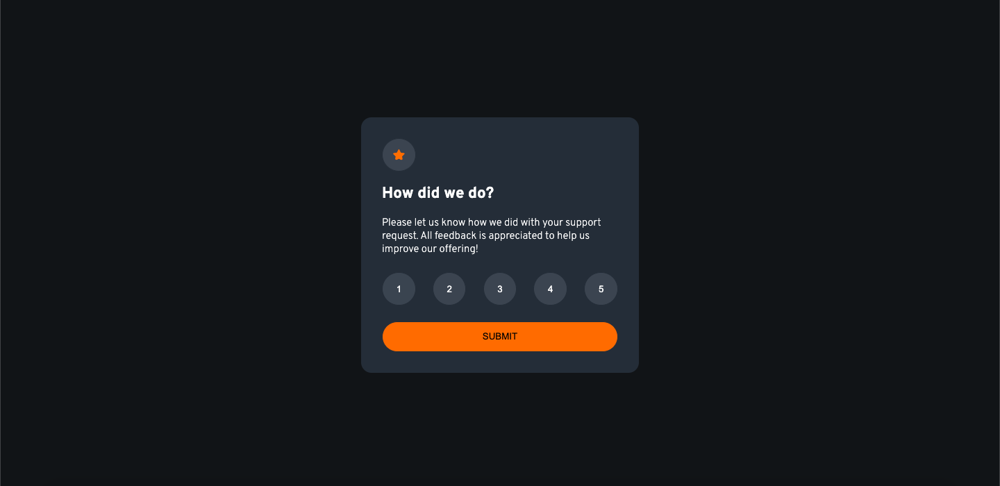

# Frontend Mentor - Interactive rating component solution

This is a solution to the [Interactive rating component](https://www.frontendmentor.io/challenges/interactive-rating-component-koxpeBUmI/hub). Frontend Mentor challenges help you improve your coding skills by building realistic projects. 

## Table of contents

- [Overview](#overview)
  - [The challenge](#the-challenge)
  - [Screenshot](#screenshot)
  - [Links](#links)
- [My process](#my-process)
  - [Built with](#built-with)
  - [What I learned](#what-i-learned)
- [Author](#author)

## Overview

### The challenge

Users should be able to:

- Select and submit a number rating
- See the "Thank you" card state after submitting a rating
- See hover and focus states for all interactive elements on the page

### Screenshot



### Links

- Solution URL: [Add solution URL here](https://your-solution-url.com)
- Live Site URL: [Add live site URL here](https://your-live-site-url.com)

## My process

### Built with

- Semantic HTML5 markup
- CSS custom properties
- Mobile-first workflow
- Flexbox markup
- JavaScript markup
- Sass markup

### What I learned

```css
$primary-color: hsl(25, 97%, 53%);
$primary-font-size: 0.9375em;
$background-body: hsl(216, 12%, 8%);
$background-main: hsl(213, 19%, 18%);
$background-button: hsla(217, 12%, 63%, 0.2);
$color-main: hsl(0, 0%, 100%);
```
```js
buttons.forEach(button => {
    button.addEventListener('click', function() {
        console.log('Button clicked');
        buttons.forEach(btn => {
            btn.classList.remove('active');
        });
        this.classList.add('active');
        selectedRating = this.innerText;
    });
});
```

## Author

- Github - [Rakhat Zhumabek](https://github.com/R3iwan)
- Frontend Mentor - [@R3iwan](https://www.frontendmentor.io/profile/R3iwan)

